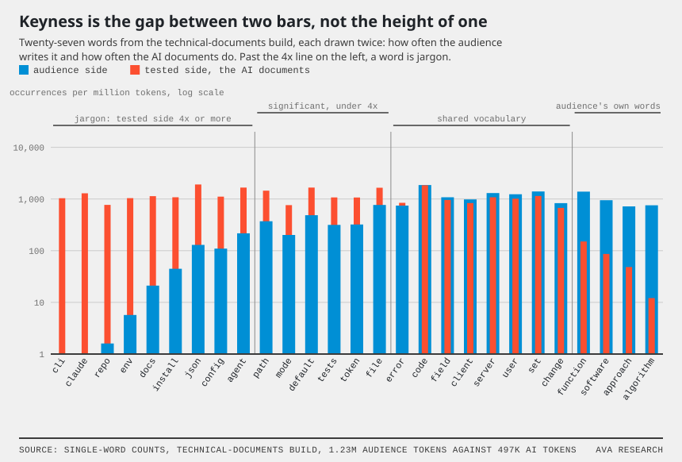
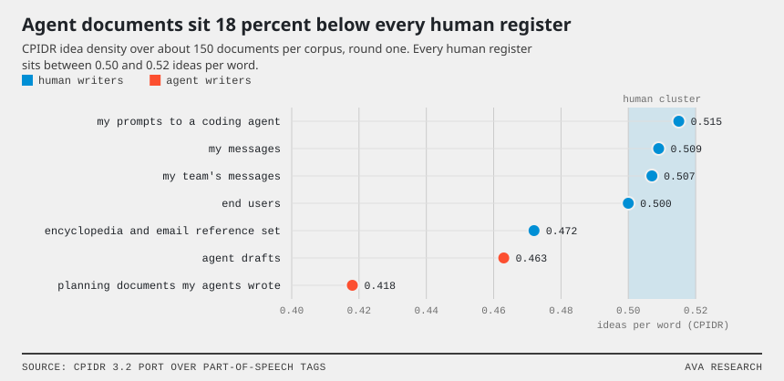
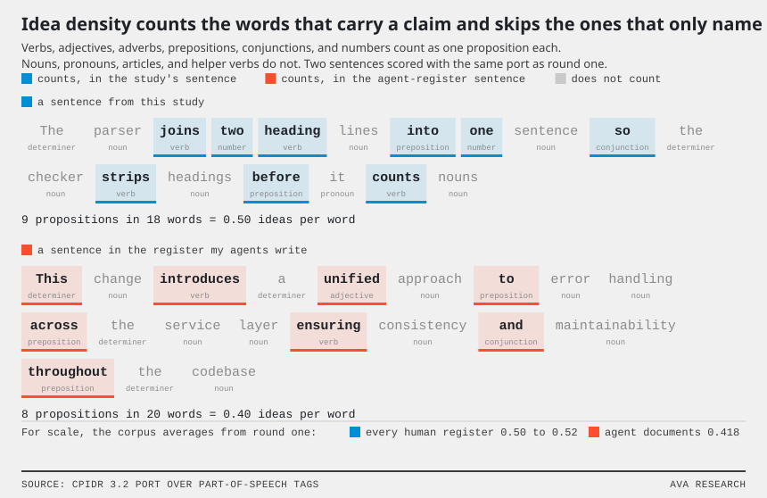
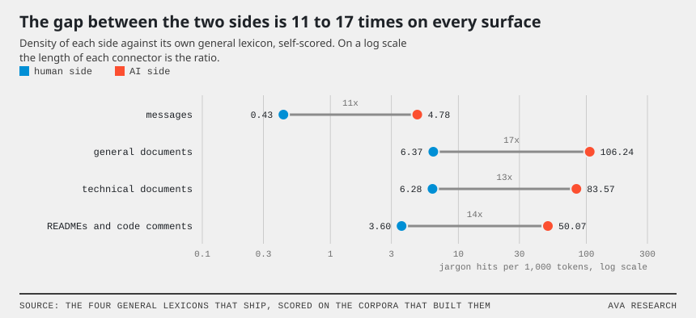

# Jargon Lexicon study

`ava` is a command-line tool that checks prose a coding agent wrote. `ava check` runs rules over a draft and prints a jargon density line. `ava jargon` builds a lexicon from two corpora and scores text against it. I built the jargon scorer to replace an opinion with a measurement.

This study records how I chose the method behind `ava jargon build`: two corpora, five statistical tests, and the value each test uses. I ran the study in two rounds. The first round measured the writers of my own organization against each other. The second round built the four universal lexicons that ship with `ava check`.

## Background

I work at a software company and run AI agents to help me do much of my work. The agents often create content that uses a tone, register, or voice my audience does not share. To help with this, I've built many "subagents" that a main agent can use to check whether its output matches the expected tone, register, or voice for a given document's target audience.  I call this particular flavor of subagents "judgement gates." A "judgement gate" subagent has its own prompt with a rule list that reads a draft given to it by the main agent and returns PASS or FAIL based on the rules, along with recommendations. Subjectively, I found that telling an AI agent to use a "judgement gate" on a document it was writing significantly improved its readability. 

I have created over a dozen judgement gates for my different content surfaces (JIRA, notion, slack etc) and hundreds of judgement gate uses by my AI agents. One thing that "judgement gates" proved bad at checking for was *jargon* - or using the same words that my team used to refer to the things that my team worked on. The output was almost inescapably correct, referring to projects by their full name where we would abbreviate. 

> How my team talks: "Can you push those changes to the modeler?"
>
> How my ai would talk "Can you push change a23a3hnsi93 to `evo-modeler-dev`"

I began to think that there were simple, mechanical ways to measure the "distance" between how humans write and how agents write. A gate returns a verdict and no distance, so it cannot tell me how far a draft sits from the audience. I wanted a number.

### Definitions

The study uses these definitions throughout:

1. A *corpus* is a directory of documents, one text file each. A token is one lowercase word from a document.
2. Two *corpuses* can be compared by deeming one the *audience* corpus and the other the *tested* corpus. The command line calls them *approved* and *contrast*.
   1. The *audience* side is a *corpus* of the audience's own writing - the control group.
   2. The *tested* side is a corpus of the writing under test.
3. A *build* is one run of `ava jargon build` over an audience side and a tested side.
4. A *lexicon* is the dictionary that is built when you compare an *audience* and a *tested* corpus. It contains
   1. The jargon words the tested side over-uses
   2. The approved vocabulary of the audience.
5. *Density* is jargon hits per 1,000 tokens of a scored text. *Coverage* is the share of its content words inside the approved vocabulary.
6. A *surface* is the kind of text under check. I use four: messages, general documents such as memos and essays, technical documents such as specs and papers, and READMEs with code comments. The command line calls them `chat`, `doc-shared`, `doc-technical`, and `code`. Each surface has its own lexicon.
7. A *resampled range* is a 95 percent range for a difference between two densities, from 2,000 random redraws of the documents behind each (a bootstrap). A difference is credible where the range excludes zero.
8. *Idea density* is a separate measure from jargon density: propositions per word. It comes from CPIDR, a computerized rater of propositional idea density by Brown and others (2008). Human prose sits near 0.5.
9. A *self-scored number* scores the same corpus that built the lexicon. A *fresh-sample number* scores a corpus the build never saw.

Corpus linguists call the statistical comparison of two corpora keyness. Dunning (1993) supplies the significance test, Hardie (2014) the effect size, and Burrows (2007) the document-share idea. The appendix cites each source.

## Question

Can a script measure jargon in a way an agent can act on? Style guides name jargon by opinion, and my judgement gates inherited that opinion. I wanted to know whether the audience's own writing could name it instead, and whether the number that came out would sort writers the way a reader does: end users at one end, my agents at the other.

## Method

### Gathering Samples

I needed a lot of text I knew was human and a lot I knew was AI before any of this meant anything. Overall I was able to accumulate a modest sampling from the following sources:

- My own corner of the world: eight months of my chat messages, six months of my team's chat, the messages our end users send us, my typed prompts to my coding agent, and 249 planning documents my agents wrote.
- A before-and-after set: 16 chat drafts an agent wrote, and the same 16 as they landed after a judgement gate.
- Two "normal English" reference sets: encyclopedia articles on computing, and a public archive of 2001-era workplace email.
- For the second round, public text I could date. Pre-2022 forums, mailing lists, essays, letters, standards documents, and open-source docs on the human side. On the AI side, text with a record of who wrote it: a dataset label, the model that generated it, or a commit message line naming the coding agent.

The Data section lists each with its size.

### Keyness over raw frequency

My first instinct was a frequency list: count the words in my agents' documents and read the top. That fails immediately, because the top of any frequency list is the topic of the corpus plus ordinary English, and it can't tell me which of those words my audience would never say. So I borrowed *keyness* from corpus linguistics: put the audience's writing on one side, the writing under test on the other, and ask which words the tested side over-uses relative to the audience side. I call a word jargon only when it passes five tests:

| Plain name | What it asks | The statistic | Default |
| --- | --- | --- | --- |
| the significance test | Is the gap between the two sides bigger than chance would produce? | Dunning log-likelihood, G2 | G2 at or above 15.13 |
| the ratio test | Does the tested side use the word many times more often? | Hardie log ratio, base 2 | at or above 2.0, which is four times |
| the spread floor | Do many tested documents use the word, not one? | share of tested documents | at or above the floor |
| the spread ceiling | Do few audience documents use the word? | share of audience documents | at or below the ceiling |
| the everyday-English test | Is the word rare in ordinary English? | Zipf frequency | below 5.0, single words only |

I borrowed all of these defaults from existing literature:

1. 15.13 is the point on the chi-square scale where chance explains fewer than 1 result in 10,000. A build tests thousands of candidate words at once, so the bar has to survive that many comparisons.
2. A ratio of 2.0 on a base-2 log scale means the tested side uses the word at least four times as often. Because the significance test grows with corpus size, a big enough corpus makes any tiny gap pass it, so the ratio test pins the size of the gap.
3. The spread floor throws out one document's quirk. The spread ceiling throws out anything the audience says too.
4. A Zipf score of 5.0 means about ten uses per million words of everyday English (the `wordfreq` package supplies the score). Phrases skip this test on purpose: "ingestion pipeline" is jargon even when "pipeline" alone is ordinary.

A few smaller rules ride along:

- A word needs at least five uses on the tested side, because the significance test rests on an approximation that wants roughly five expected uses.
- Candidates are single words, two-word phrases, and three-word phrases. A phrase that starts or ends on a function word (a, the, of, and the like) doesn't count.
- The *approved vocabulary* is every word the audience uses three or more times across at least two documents. The two-document floor keeps one writer's quirk from becoming "the audience's vocabulary".
- Proper names never count as jargon. `app/name_stoplist.txt` holds the list.

The figure shows the tests at work on the technical-documents build. It draws twenty-seven words twice, once per side, sorted by the ratio test. In the middle the two bars match, and that is the shared vocabulary a frequency list would rank first. Moving left, the tested side's bar grows over an emptying audience bar until, past the 4x line, the word is jargon.

### Spread across documents, scaled by document length

The first round broke a fixed spread requirement right away. I started with a floor of 10 percent of documents. My chat corpus is 5,733 messages with a median length of 9 tokens, so 10 percent means a word has to show up in 573 separate messages, and nothing does. The same 10 percent against 249 planning documents with a median of 1,230 tokens is 25 documents, which is easy. A fixed share can't serve both, so the build scales each share by the median document length of its own side. The 250 in each formula is the reference length: a side whose median document is 250 tokens gets the base share unchanged.

| Share | Formula | Held between | Minimum documents |
| --- | --- | --- | --- |
| spread floor, tested side | 0.10 x median length / 250 | 0.015 and 0.10 | 8 |
| spread ceiling, audience side | 0.05 x median length / 250 | 0.01 and 0.05 | 3 |

The lexicon file's header records whatever values the build landed on. A side of 9-token messages gets the bottom of the range, a side of 1,230-token documents gets the top, and if you set a share yourself the scaling gets out of the way.

### Two rounds

Round one, 2026-08-18, was the internal one: everything I hold from my own organization, run through a script that builds five lexicons in different pairings, scores every corpus against the end-user lexicon, runs two resampled comparisons, and computes idea density.

Round two, 2026-08-25, was the public one. The trick for the human side is the calendar: anything published before 2022 predates usable language models. The trick for the AI side is a record of who wrote it: a named model or a named coding agent. One build per surface gave me the four general lexicons that ship.

### Validating against a holdout group

I validate each lexicon against a holdout group: a sample of the audience's own writing, scored with the lexicon that is supposed to represent that audience. The lexicon passes when the holdout scores near zero density and high coverage. High density there means the lexicon is wrong for that audience, and it goes back to the build. Round one held out the end users' own messages against the end-user lexicon. Round two held out each surface's human corpus against its general lexicon. In both rounds the holdout was the audience side itself, so each lexicon scored the text that built it; the Limits section says what a fresh holdout would change.

## Data

Round one was eleven corpuses, about 1.1 million tokens. I list each by type rather than by name, because several are private.

| Corpus type | Documents | Tokens |
| --- | --- | --- |
| end-user messages and ticket comments | 507 | 23k |
| my team's messages, five authors, six months | 690 | 19k |
| my messages, eight months | 5,733 | 82k |
| my typed prompts to a coding agent | 1,354 | 50k |
| planning documents my agents wrote | 249 | 395k |
| agent drafts before a judgement gate, and the same drafts as posted | 16 and 16 | 1.7k and 1.3k |
| encyclopedia computing articles and 2001-era workplace email | 1,279 | 147k |

Round two built one lexicon per surface. The human side is human because of its date. Each AI corpus carries some record of who wrote it: a dataset label, the model that generated it, a commit message line naming the coding agent, or (weakest) admission by the mechanical checks.

| Surface | Audience side | Documents / tokens | Tested side | Documents / tokens |
| --- | --- | --- | --- | --- |
| messages | pre-2022 technology-forum comments, IRC support chat, standards mailing-list email, 2001-era workplace email | 3,178 / 432k | replies I had three sizes of model write, and 2024 replies from the strongest public models | 618 / 152k |
| general documents | pre-2022 shareholder letters, investor memos, startup essays, longform journalism, software-magazine articles, plain-language guides, encyclopedia articles | 1,040 / 1.78M | post-2024 blog posts and marketing copy | 112 / 230k |
| technical documents | pre-2022 standards documents, open-source project documentation, computer-science preprints, technical exposition articles, a reliability-engineering book | 604 / 1.23M | post-2024 repository documents a coding agent wrote | 314 / 497k |
| READMEs and code comments | pre-2022 READMEs and code comments | 1,509 / 223k | post-2024 READMEs and code comments a coding agent wrote | 1,287 / 112k |

## Results

### Round one

The end-user lexicon sorts every writer by how far they sit from the audience, and the order surprised me:

| Writer | Density | Coverage |
| --- | --- | --- |
| end users, against their own lexicon | 0.22 | 81% |
| encyclopedia and workplace-email reference set | 0.61 | 38% |
| planning documents my agents wrote | 5.73 | 42% |
| my prompts to a coding agent | 6.91 | 53% |
| my messages | 7.11 | 63% |
| agent drafts before the judgement gate | 7.86 | 53% |
| agent drafts as posted | 9.18 | 53% |
| my team's messages | 11.05 | 66% |

A few things fall out of that table:

1. The end-user lexicon is tiny, 10 words, because both sides sat under 30k tokens and keyness doesn't settle down below that.
2. Vocabulary runs one way. My agents use 362 words I never type; the reverse build found nothing I say that they don't. They have absorbed my vocabulary entirely, and the only risk is imports.
3. Judgement gates change shape, not words. Density from draft to posted message moved by -1.32 per 1,000 tokens, with a resampled 95 percent range of -9.95 to +7.37. Gated posts landed +2.07 above my own messages, range -4.26 to +8.73. Both ranges include zero. With 16 pairs I treat both as directional, and the direction is that the gate never touched the vocabulary.
4. The one "AI accent" I can measure is dilution. Every human register clusters at 0.50 to 0.52 ideas per word: my prompts 0.515, my messages 0.509, my team 0.507, end users 0.500. The reference set sits at 0.472, the agent drafts at 0.463, and the planning documents at 0.418, about 18 percent below the humans.
5. I have two voices. My messages and my prompts, both typed by me, split cleanly on 26 words: the prompt side is command verbs and the names of tools and branches. I talk to agents in imperatives I would never send a colleague.

Idea density, drawn two ways: the corpus averages, then what the measure counts inside a sentence.

### Round two

Word counts and self-scored densities for the four general lexicons. Self-scored means each lexicon scored the same text that built it, so the gap is the best case, not the expected case:

| Surface | Jargon words | Human density | AI density | Human coverage | AI coverage |
| --- | --- | --- | --- | --- | --- |
| messages | 8 | 0.43 | 4.78 | 92% | 79% |
| general documents | 409 | 6.37 | 106.24 | 96% | 92% |
| technical documents | 260 | 6.28 | 83.57 | 95% | 77% |
| READMEs and code comments | 127 | 3.60 | 50.07 | 86% | 70% |

Look at the top of each list and you see the topic of the tested corpus, not a style: `ai`, `seo`, `chatgpt` for general documents; `md`, `claude`, `json` for technical ones; `claude`, `ai`, `agent` for READMEs and comments. The messages lexicon has only 8 words because the generated replies talk about the same things the forum posts do, and it has the smallest gap. This is why the density line only advises.

## Decisions

Here is what I changed in the tool, and why:

1. `ava jargon build` runs the five tests with the defaults above; the options `--ll`, `--lr`, `--min-contrast-dispersion`, `--max-approved-dispersion`, `--zipf-gate`, and `--stoplist` override them.
2. Spread scales by median document length unless you set it, because my 5,733 nine-token messages made a fixed share impossible.
3. The lexicon README asks for 30k+ tokens a side, because the 10-word lexicon showed what happens below that.
4. `ava check` picks the general lexicon for the surface, because each surface has its own tested register.
5. W-M10, the jargon-density line that `ava check` prints, only advises. The word lists are topical, and no single threshold fits my team at 11.05 and our end users at 0.22. It prints; it never sets the exit code.
6. `ava jargon extend` only ever adds to the audience side, because the vocabulary result showed the risk runs one way.
7. `ava jargon delta` reports a resampled range and only calls a difference credible when the range excludes zero, so a difference inside the range reads as noise.
8. The build strips code from `.md` files, because file-extension tokens like `ts` and `md` padded the 362-word list.
9. The README tells you to score the audience's own writing before you trust a lexicon.

## Limits

What I don't trust yet:

1. Round two is self-scored; a fresh sample of the same kind of text would show a smaller gap.
2. The tested corpuses are about AI tools, so the word lists mark topic as much as author. Density alone carries the signal; the lists mark topic.
3. 16 paired chat samples. Directional only.
4. Both sides of the end-user lexicon sat under the token floor. The order of the ladder I trust; the exact numbers will move as corpuses grow.

## Appendix: references

The statistics are borrowed, not invented. Sources:

- Idea density, the CPIDR measure: Brown, C., Snodgrass, T., Kemper, S. J., Herman, R., and Covington, M. A. (2008). Automatic measurement of propositional idea density from part-of-speech tagging. Behavior Research Methods, 40(2), 540-545.
- Spread across documents, the Zeta measure: Burrows, J. (2007). All the way through: testing for authorship in different frequency strata. Literary and Linguistic Computing, 22(1), 27-47.
- The significance test, G2: Dunning, T. (1993). Accurate methods for the statistics of surprise and coincidence. Computational Linguistics, 19(1), 61-74.
- The ratio test, log ratio: Hardie, A. (2014). Log Ratio: an informal introduction. ESRC Centre for Corpus Approaches to Social Science, Lancaster University.
- Everyday-English frequencies behind the Zipf test: Speer, R. wordfreq. https://github.com/rspeer/wordfreq
- The Zipf scale of word frequency: van Heuven, W. J. B., Mandera, P., Keuleers, E., and Brysbaert, M. (2014). SUBTLEX-UK: a new and improved word frequency database for British English. Quarterly Journal of Experimental Psychology, 67(6), 1176-1190.
- The public chat dataset behind the 2024 model replies: Zhao, W., Ren, X., Hessel, J., Cardie, C., Choi, Y., and Deng, Y. (2024). WildChat: 1M ChatGPT interaction logs in the wild. ICLR 2024.
